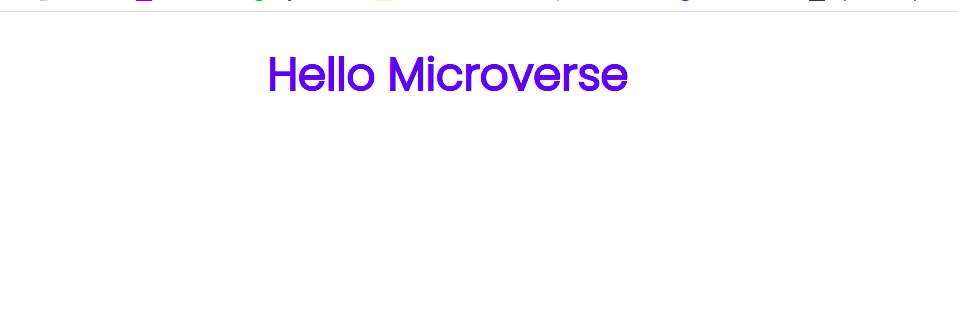

# Hello-Microverse

> This is simple project to demonstrate understanding of basic HTML and CSS. I am building a professional project and giving attention to the project documentation by including a descriptive README as a training exercise experience.

Additional description about the project and its features.

## Built With

- HTML
- style with CSS.
- Github
- VSCode

## Deployment

[Live Demo Link](https://awesome-aryabhata-aa3120.netlify.app/)

### Deployment

- Deployed using github pages

## Authors

👤 **Ignatius Sani**

- GitHub: [@ignatius22](https://github.com/ignatius22)
- Twitter: [iggy_code](https://twitter.com/iggy_code)
- LinkedIn: [ignatiussani](https://linkedin.com/in/ignatiussani)

## 🤝 Contributing

Contributions, issues, and feature requests are welcome!

Feel free to check the [issues page](https://github.com/ignatius22/hello-microverse/issues/).

## Show your support

Give a ⭐️ if you like this project!

## Acknowledgments

- Hat tip to anyone whose code was used
- Inspiration
- etc

## 📝 License

This project is [MIT](./MIT.md) licensed.
